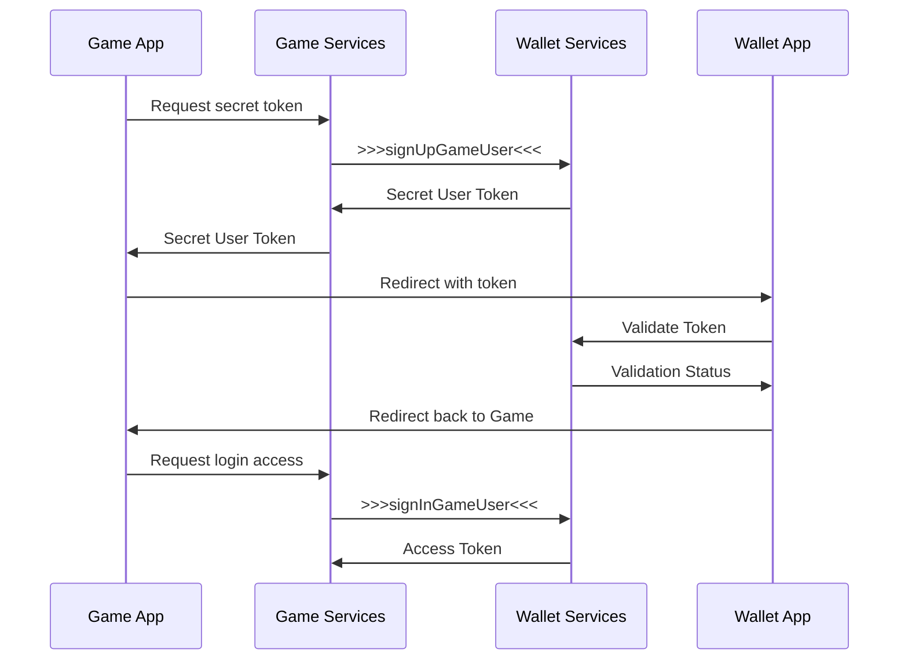

# Регистрация и авторизация

## Общее описание механизма работы

Поддерживается два режима работы с API, условно анонимный и авторизованный.&#x20;

Условно анонимный режим дает право заводить аккаунт в валюте игры, пополнять счет через игру, делать ставки на турниры и получать награды за турниры. Но в данном режиме пользователь не может вывести деньги из игры куда-либо. Так же в случае анонимного режима могут быть ограничения на максимальное количество денег на счету.

Авторизованный режим снимает ограничения и позволяет выполнять все операции, включая переводы денег из игры в кошелек (для последующего вывода на банковский счет или карту). Данный режим подразумевает, что у пользователя есть полноценный действующий аккаунт в LinQ Wallet.

Для работы с API и организации/ограничения доступа используются определенные ключи и токены. Подробнее о типах токенов можно прочитать на странице [tokens.md](/modules/tokens.md "mention").

## Порядок авторизации в сервисах LinQ Wallet

Пошаговое руководство регистрации пользователя. Примеры далее приведены на TypeScript, но названия методов актуальны для любого языка программирования.

### Регистрация пользователя на стороне кошелька

Сразу после регистрации пользователя в игре или первого входа, стоит его зарегистрировать в LinQ Wallet, чтобы у него была возможность пополнять свой счет.

Для начала необходимо зарегистрировать запрос от стороннего сервиса и получить токен доступа (Access Token) для выполнения регистрации.

Для получения токена используется сервис [AuthGameService](https://buf.build/linq/linq/docs/main:linq.auth.game.v1#linq.auth.game.v1.AuthGameService) и метод [SignInGame](https://buf.build/linq/linq/docs/main:linq.auth.game.v1#linq.auth.game.v1.AuthGameService.SignInGame).

```typescript
const authGameService = new AuthGameServiceClient(getTransport());

const payload = await authGameService.signInGame({
      gameToken: process.env.GAME_SECRET ?? '', // private secret key
      gameUserId: user.id, // your internal user identifier
});

user.accessToken = payload.response.accessToken;
// save user
```

После этого можно использовать данный токен для других запросов, например, для проверки баланса пользователя.&#x20;

```typescript
const accountsService = new AccountsServiceClient(getTransport());

const gamingBalance = await accountsService.getActualBalance(
    { currency: "GMC" }, 
    getAuthorization(user.accessToken)
);
```

### Авторизация пользователя на стороне кошелька

Вход и авторизация через приложение имеет несколько стадий и способов взаимодействия на этих стадиях. Применение каждого способа зависит от технических возможностей.

После регистрации анонимного аккаунта по желанию пользователя следует предоставить ему возможность войти через LinQ Wallet, тем самым связав аккаунт игры и кошелька.

Обычно после перехода в кошелек пользователю предлагается завести там аккаунт, если его еще нет, или войти в уже существующий. Опционально через API можно создать пользователя в сервисах LinQ Wallet и предложить ему сразу войти в созданный для него аккаунт, минуя этап регистрации.

#### Общая схема авторизации



#### Запрос на авторизацию

Перед началом авторизации для текущего пользователя необходимо сформировать секретный токен, который будет использоваться для валидации запроса на стороне кошелька. Для этого стоит использовать сервис и метод.

```typescript
const service = new AuthUserServiceClient(getTransport());

const payload = await service.signUpGameUser({}, getAuthorization(user.accessToken));

// should be returned to the App
// payload.response.userToken
```

В данном запросе так же можно передать данные пользователя, тем самым создав для него аккаунт в сервисах кошелька. Важно, что в таком случае на стороне игры, перед перенаправлением пользователя в приложение кошелька, нужно очевидным и понятным способом предупредить пользователя, что для него будет создан аккаунт в стороннем приложении.&#x20;

```typescript
const service = new AuthUserServiceClient(getTransport());

const payload = await service.signUpGameUser({
    dob: "",
    phone: "+375291234567",
    email: "u1@sendmail.co"
    first_name: "Fist"
    last_name: "Last"
}, getAuthorization(user.accessToken));

// payload.response.userToken
```

Не обязательно, но рекомендуется дополнительно запросить у него на это разрешение путем добавления checkbox с подобным вопросом или в виде отдельного всплывающего окна с тем же вопросом.

#### Валидация запроса пользователя

Полученный токен следует добавить в ссылку (deep link), которая откроет приложение LinQ Wallet, где пользователь сможет авторизовавшись в своем аккаунте, подтвердить запрос со стороны игры. Тем самым игровой аккаунт будет связан с аккаунтом кошелька. В случае, если приложение кошелька не установлено, следует отправить пользователя в App Store для установки.


```
var linqUrlTemplate = 'linq-stg://?user_token={0}';
```


<!--  -->
```
var linqUrlTemplate = 'linq://?user_token={0}';
```


```csharp
var sid = "123455678";
var storeLink = sid != "" ? "itms-apps://apps.apple.com/app/id" + sid : "itms-beta:";
var inappLink = string.Format(linqUrl, response.token);

Application.OpenURL(IOSCanOpenURL.CheckUrl(inappLink) ? inappLink : storeLink);
```

Так же существует способ передачи токенов через Keychain, который используется в случаях, когда приложение кошелька еще не установлено на устройстве пользователя. Подробнее о данном методе на странице [keychain.md](/modules/keychain.md "mention").

#### Авторизация и получение токена доступа

После подтверждения запроса со стороны игры в приложении кошелька, пользователь будет возвращен обратно в игру. Далее на стороне игры следует произвести авторизацию пользователя в сервисах кошелька, используя его текущий токен доступа и секретный код. В ответ на запрос будет возвращен access\_token и wallet\_id, которые следует сохранить в профиль пользователя на стороне игры.

```typescript
const service = new AuthUserServiceClient(getTransport());

const data = {
    userToken: "token-value" // value that returned on token request
};

const payload = await service.signInGameUser(data, getAuthorization(authToken));

// payload.response.accessToken
// payload.response.id
```

