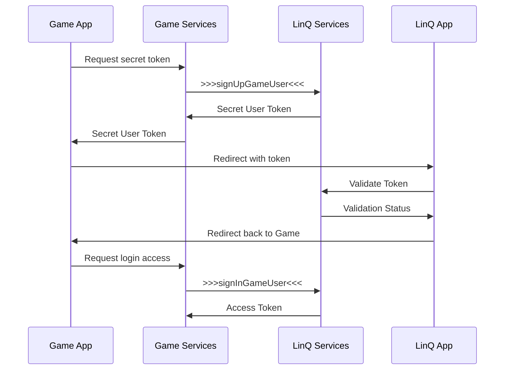

# Authentication

## Approach Description

Two modes of working with the API are supported: conditionally anonymous and authorized.

The conditionally anonymous mode gives you the right to create an account in the game currency, top up your account through the game, place bets on tournaments and receive rewards for tournaments. But in this mode, the user cannot withdraw money from the game anywhere. Also, in the case of anonymous mode, there may be restrictions on the maximum amount of money in the account.

The authorized mode removes restrictions and allows you to perform all operations, including transferring money from the game to your wallet (for subsequent withdrawal to a bank account or card). This mode assumes that the user has a full-fledged active account in LinQ services.

To work with the API and organize/restrict access, certain keys and tokens are used. More information about token types can be found on the page [Types of tokens](/modules/auth/tokens).

## Authorization procedure in LinQ services

Step-by-step user registration guide. The examples below are given in TypeScript, but the names of the methods are relevant for any programming language.

### User registration on the app side

Immediately after the user registers in the game or logs in for the first time, it is worth registering him in LinQ app so that he has the opportunity to top up his account.

First, you need to register a request from a third-party service and obtain an Access Token to complete the registration.

To obtain a token, use the [AuthGameService](https://buf.build/linq/linq/docs/main:linq.auth.game.v1#linq.auth.game.v1.AuthGameService) service and the [SignInGame](https://buf.build/linq/linq/docs/main:linq.auth.game.v1#linq.auth.game.v1.AuthGameService.SignInGame).

```typescript
const authGameService = new AuthGameServiceClient(getTransport());

const payload = await authGameService.signInGame({
      gameToken: process.env.GAME_SECRET ?? '', // private secret key
      gameUserId: user.id, // your internal user identifier
});

user.accessToken = payload.response.accessToken;
// save user
```

After this, you can use this token for other requests, for example, to check the user's balance.

```typescript
const accountsService = new AccountsServiceClient(getTransport());

const gamingBalance = await accountsService.getActualBalance(
    { currency: "GMC" },
    getAuthorization(user.accessToken)
);
```

### User authorization on the app side

Login and authorization through the application has several stages and methods of interaction at these stages. The use of each method depends on technical capabilities.

After registering an anonymous account, at the user’s request, you should provide him with the opportunity to log in through LinQ app, thereby linking the game account and wallet.

Usually, after going to the wallet, the user is prompted to create an account there, if he doesn’t already have one, or log into an existing one. Optionally, via the API, you can create a user in LinQ services and invite him to immediately log into the account created for him, bypassing the registration stage.

#### General authorization scheme



#### Authorization request

Before authorization begins, a secret token must be generated for the current user, which will be used to validate the request on the wallet side. To do this, you should use a service and method.

```typescript
const service = new AuthUserServiceClient(getTransport());

const payload = await service.signUpGameUser({}, getAuthorization(user.accessToken));

// should be returned to the App
// payload.response.userToken
```

In this request, you can also transfer user data, thereby creating an account for him in the LinQ services. It is important that in this case, on the game side, before redirecting the user to the LinQ application, you need to warn the user in an obvious and understandable way that an account will be created for him in a third-party application.

```typescript
const service = new AuthUserServiceClient(getTransport());

const payload = await service.signUpGameUser({
    dob: "",
    phone: "+375291234567",
    email: "u1@sendmail.co"
    first_name: "Fist"
    last_name: "Last"
}, getAuthorization(user.accessToken));

// payload.response.userToken
```

Not necessarily, but it is recommended to additionally request his permission for this by adding a checkbox with a similar question or in the form of a separate pop-up window with the same question.

#### User request validation


##### With LinQ App

The received token should be added to a deep link, which will open the LinQ application, where the user can log in to his account and confirm the request from the game. Thus, the game account will be linked to the wallet account. If the LinQ application is not installed, the user should be sent to the App Store for installation.

```
var linqUrlTemplate = 'linq-stg://?user_token={0}';
```


<!--  -->
```
var linqUrlTemplate = 'linq://?user_token={0}';
```

```csharp
var sid = "123455678";
var storeLink = sid != "" ? "itms-apps://apps.apple.com/app/id" + sid : "itms-beta:";
var inappLink = string.Format(linqUrl, response.token);

Application.OpenURL(IOSCanOpenURL.CheckUrl(inappLink) ? inappLink : storeLink);
```

Or you can use Associated domain that opens app if installed and redirects to App store (or Testflight for staging) if not installed

```
https://a.stg.linq.gg?user_token={token} // stage
https://a.linq.gg?user_token={token} // prod
```

There is also a method of transferring tokens through Keychain, which is used in cases where the LinQ application is not yet installed on the user’s device. More information about this method on the page [keychain.md](/modules/autherntication/keychain.md "mention").

##### With LinQ Web

Redirect to web login page to verify received token. It can opened either through webview or in separate browser window.

```
https://s.stage.linq.gg/verify_token?token=${userToken} // Staging
```

```
https://s.linq.gg/verify_token?token=${userToken} // Production
```

If use webview you can close it and proceed after page will be redirected to `/verify_success` path. All errors will redirect to `/error`.

#### Authorization and obtaining an access token

After confirming the request from the game in the LinQ application, the user will be returned back to the game. Next, on the game side, you should authorize the user in the LinQ services using his current access token and secret code. In response to the request, an `access_token` and `wallet_id` will be returned, which should be saved to the user profile on the game side.

```typescript
const service = new AuthUserServiceClient(getTransport());

const data = {
    userToken: "token-value" // value that returned on token request
};

const payload = await service.signInGameUser(data, getAuthorization(authToken));

// payload.response.accessToken
// payload.response.id
```

## Save game user data to anonymous profile to avoid deposit limits

To avoid [deposit limits](/modules/money#anonymous-profiles) you need to provide user's game account info using [SaveGameUser](https://buf.build/linq/linq/docs/main:linq.auth.user.v1#linq.auth.user.v1.AuthUserService.SaveGameUser)

```typescript
const service = new AuthUserServiceClient(getTransport());

const payload = await service.saveGameUser({
    user: {
        dob: <date_of_birth>,
        phone: "+11111111",
        email: "test@test.com"
        first_name: "Fname"
        last_name: "Lname"
    }
}, getAuthorization(user.accessToken));
```
